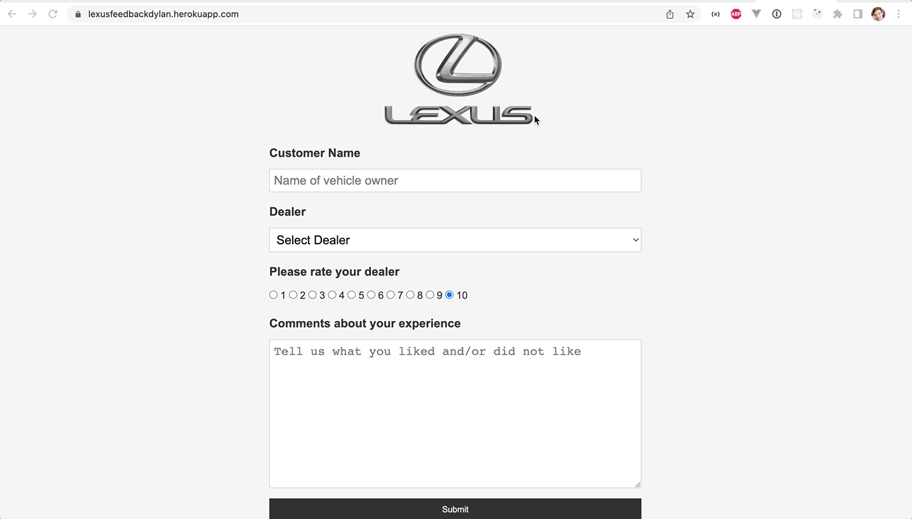
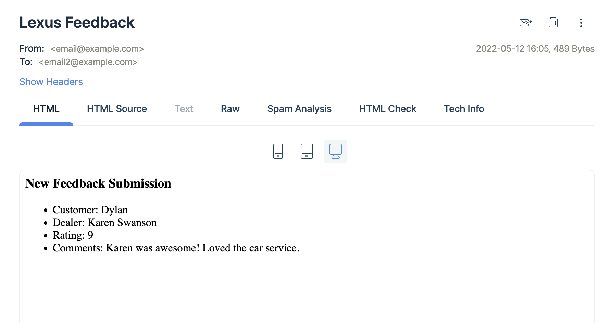

# Lexus Dealership Service Feedback Demo App

This app is a [Flask tutorial by Brad Traversy](https://www.youtube.com/watch?v=w25ea_I89iM) that I followed along with. It is the first app that I built with Python, and the first time I've seen Flask!

It is deployed through Heroku at <a href="https://lexusfeedbackdylan.herokuapp.com" target="_blank">lexusfeedbackdylan.herokuapp.com</a>.

  

## Summary

This app simulates a user providing feedback on their car service at a Lexus dealership.

The user provides the following information to a form:

- their name
- the name of the dealer who provided the service
- the rating of the service from 1 to 10
- any additional comments on the quality of the service

Upon clicking the Submit button, the app sends the above information as an email to the dealership. The email is actually sent to Mailtrap to simulate the dealership receiving it:

  

## Notes

One thing that I thought was interesting was rendering dynamic HTML by passing in a `message` variable into the `render_template` function.

The `message` was used to provide two validation messages to the user:

1. in the case that the user did not provide a value for `customer` or `dealer`, the user receives the message, "Please enter required fields."
2. in the case that the user tries to provide a value for `customer` that already exists in the database, the user receives the message, "You have already submitted feedback."

I think a natural next step would be to flesh out these validations. For example, through SQLAlchemy the app sets a maximum column length of 200 for `customer` in the database; I think it would make sense to write a validation for this case, too.

## Technologies Used

This app is built with Python3, Flask, SQLAlchemy, PostgreSQL, Heroku, HTML, and CSS.
